<h1 align="center">RetailSync AI - Architecture Documentation</h1>

<p align="center">
  <strong>Complete System Architecture & API Documentation</strong>
</p>

---

## Table of Contents

- [System Overview](#system-overview)
- [High-Level Architecture](#high-level-architecture)
- [Frontend Architecture](#frontend-architecture)
- [Backend Architecture](#backend-architecture)
- [API Architecture](#api-architecture)
- [AI Services Architecture](#ai-services-architecture)
- [Authentication Flow](#authentication-flow)
- [Data Flow](#data-flow)
- [Canvas Editor Architecture](#canvas-editor-architecture)
- [API Endpoints](#api-endpoints)
- [Database Schema](#database-schema)
- [Deployment Architecture](#deployment-architecture)

---

## System Overview

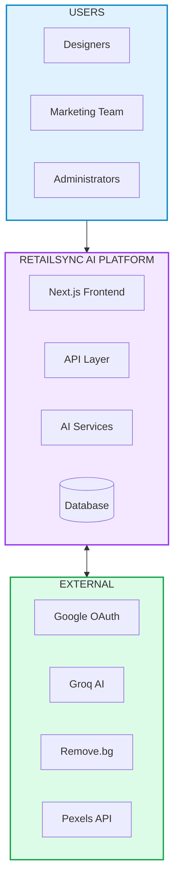
```mermaid
flowchart TB
    subgraph Users[" USERS"]
        Designer[Designers]
        Marketing[Marketing Team]
        Admin[Administrators]
    end

    subgraph Platform[" RETAILSYNC AI PLATFORM"]
        Frontend[Next.js Frontend]
        Backend[API Layer]
        AI[AI Services]
        DB[(Database)]
    end

    subgraph External[" EXTERNAL"]
        Google[Google OAuth]
        Groq[Groq AI]
        RemoveBG[Remove.bg]
        Pexels[Pexels API]
    end

    Users --> Platform
    Platform <--> External

    style Users fill:#e0f2fe,stroke:#0284c7,stroke-width:2px
    style Platform fill:#f3e8ff,stroke:#9333ea,stroke-width:2px
    style External fill:#dcfce7,stroke:#16a34a,stroke-width:2px
```

---

## High-Level Architecture

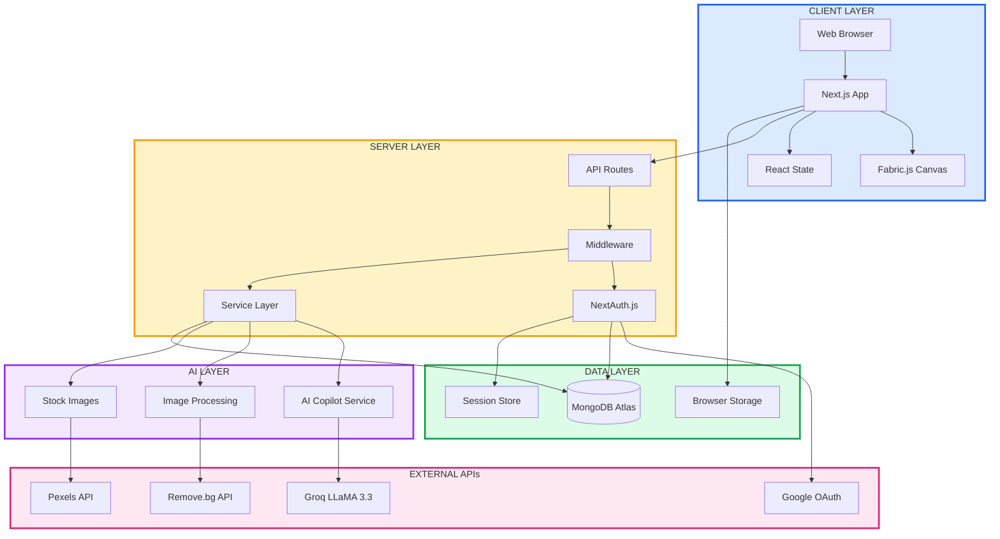
```mermaid
flowchart TB
    subgraph Client[" CLIENT LAYER"]
        direction TB
        Browser[Web Browser]
        NextApp[Next.js App]
        Canvas[Fabric.js Canvas]
        State[React State]
    end

    subgraph Server[" SERVER LAYER"]
        direction TB
        APIRoutes[API Routes]
        Middleware[Middleware]
        Auth[NextAuth.js]
        Services[Service Layer]
    end

    subgraph AI[" AI LAYER"]
        direction TB
        Copilot[AI Copilot Service]
        ImageProc[Image Processing]
        StockImg[Stock Images]
    end

    subgraph Data[" DATA LAYER"]
        direction TB
        MongoDB[(MongoDB Atlas)]
        LocalStorage[Browser Storage]
        SessionStore[Session Store]
    end

    subgraph External[" EXTERNAL APIs"]
        direction TB
        GroqAPI[Groq LLaMA 3.3]
        RemoveBGAPI[Remove.bg API]
        PexelsAPI[Pexels API]
        GoogleAPI[Google OAuth]
    end

    Browser --> NextApp
    NextApp --> Canvas
    NextApp --> State
    NextApp --> APIRoutes
    
    APIRoutes --> Middleware
    Middleware --> Auth
    Middleware --> Services
    
    Services --> Copilot
    Services --> ImageProc
    Services --> StockImg
    
    Copilot --> GroqAPI
    ImageProc --> RemoveBGAPI
    StockImg --> PexelsAPI
    Auth --> GoogleAPI
    
    Services --> MongoDB
    Auth --> MongoDB
    NextApp --> LocalStorage
    Auth --> SessionStore

    style Client fill:#dbeafe,stroke:#2563eb,stroke-width:3px
    style Server fill:#fef3c7,stroke:#f59e0b,stroke-width:3px
    style AI fill:#f3e8ff,stroke:#9333ea,stroke-width:3px
    style Data fill:#dcfce7,stroke:#16a34a,stroke-width:3px
    style External fill:#fce7f3,stroke:#db2777,stroke-width:3px
```

---

## Frontend Architecture

### Component Hierarchy

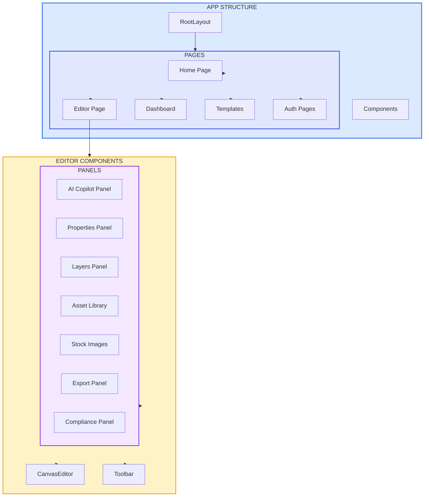
```mermaid
flowchart TB
    subgraph App[" APP STRUCTURE"]
        Layout[RootLayout]
        Pages[Pages]
        Components[Components]
    end

    subgraph Pages[" PAGES"]
        Home[Home Page]
        Editor[Editor Page]
        Dashboard[Dashboard]
        Templates[Templates]
        Auth[Auth Pages]
    end

    subgraph EditorComponents[" EDITOR COMPONENTS"]
        CanvasEditor[CanvasEditor]
        Toolbar[Toolbar]
        Panels[Side Panels]
    end

    subgraph Panels[" PANELS"]
        AICopilot[AI Copilot Panel]
        Properties[Properties Panel]
        Layers[Layers Panel]
        Assets[Asset Library]
        Stock[Stock Images]
        Export[Export Panel]
        Compliance[Compliance Panel]
    end

    Layout --> Pages
    Pages --> Home
    Pages --> Editor
    Pages --> Dashboard
    Pages --> Templates
    Pages --> Auth
    
    Editor --> EditorComponents
    EditorComponents --> CanvasEditor
    EditorComponents --> Toolbar
    EditorComponents --> Panels

    style App fill:#dbeafe,stroke:#2563eb,stroke-width:2px
    style Pages fill:#e0e7ff,stroke:#4f46e5,stroke-width:2px
    style EditorComponents fill:#fef3c7,stroke:#f59e0b,stroke-width:2px
    style Panels fill:#f3e8ff,stroke:#9333ea,stroke-width:2px
```

### State Management Flow

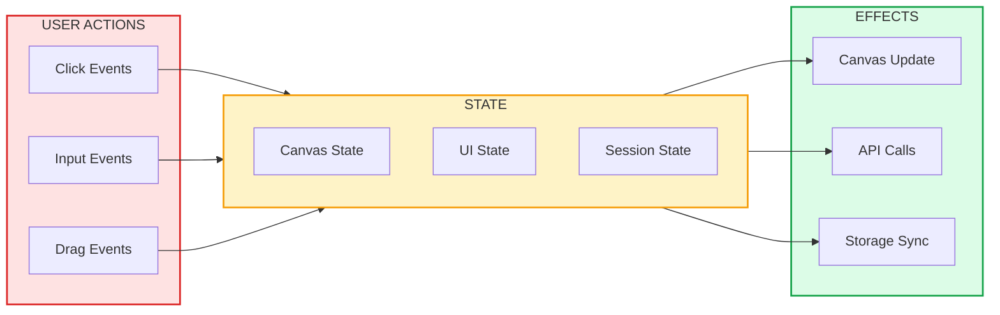
```mermaid
flowchart LR
    subgraph UserActions[" USER ACTIONS"]
        Click[Click Events]
        Input[Input Events]
        Drag[Drag Events]
    end

    subgraph State[" STATE"]
        CanvasState[Canvas State]
        UIState[UI State]
        SessionState[Session State]
    end

    subgraph Effects[" EFFECTS"]
        CanvasUpdate[Canvas Update]
        APICall[API Calls]
        StorageSync[Storage Sync]
    end

    Click --> State
    Input --> State
    Drag --> State
    
    State --> CanvasUpdate
    State --> APICall
    State --> StorageSync

    style UserActions fill:#fee2e2,stroke:#dc2626,stroke-width:2px
    style State fill:#fef3c7,stroke:#f59e0b,stroke-width:2px
    style Effects fill:#dcfce7,stroke:#16a34a,stroke-width:2px
```

---

## Backend Architecture

### API Routes Structure

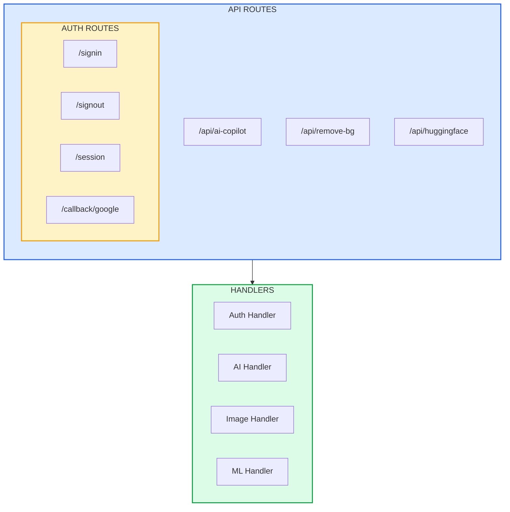
```mermaid
flowchart TB
    subgraph Routes[" API ROUTES"]
        direction TB
        AuthRoutes["/api/auth/*"]
        AIRoutes["/api/ai-copilot"]
        ImageRoutes["/api/remove-bg"]
        MLRoutes["/api/huggingface"]
    end

    subgraph AuthRoutes[" AUTH ROUTES"]
        Signin["/signin"]
        Signout["/signout"]
        Session["/session"]
        Callback["/callback/google"]
    end

    subgraph Handlers[" HANDLERS"]
        AuthHandler[Auth Handler]
        AIHandler[AI Handler]
        ImageHandler[Image Handler]
        MLHandler[ML Handler]
    end

    Routes --> Handlers

    style Routes fill:#dbeafe,stroke:#2563eb,stroke-width:2px
    style AuthRoutes fill:#fef3c7,stroke:#f59e0b,stroke-width:2px
    style Handlers fill:#dcfce7,stroke:#16a34a,stroke-width:2px
```

### Middleware Pipeline

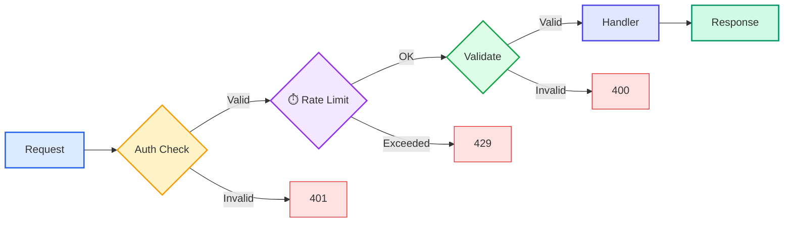
```mermaid
flowchart LR
    Request[ Request] --> Auth{ Auth Check}
    Auth -->|Valid| RateLimit{⏱️ Rate Limit}
    Auth -->|Invalid| Reject1[ 401]
    RateLimit -->|OK| Validate{ Validate}
    RateLimit -->|Exceeded| Reject2[ 429]
    Validate -->|Valid| Handler[ Handler]
    Validate -->|Invalid| Reject3[ 400]
    Handler --> Response[ Response]

    style Request fill:#dbeafe,stroke:#2563eb,stroke-width:2px
    style Auth fill:#fef3c7,stroke:#f59e0b,stroke-width:2px
    style RateLimit fill:#f3e8ff,stroke:#9333ea,stroke-width:2px
    style Validate fill:#dcfce7,stroke:#16a34a,stroke-width:2px
    style Handler fill:#e0e7ff,stroke:#4f46e5,stroke-width:2px
    style Response fill:#d1fae5,stroke:#059669,stroke-width:2px
    style Reject1 fill:#fee2e2,stroke:#dc2626
    style Reject2 fill:#fee2e2,stroke:#dc2626
    style Reject3 fill:#fee2e2,stroke:#dc2626
```

---

## API Architecture

### Complete API Flow

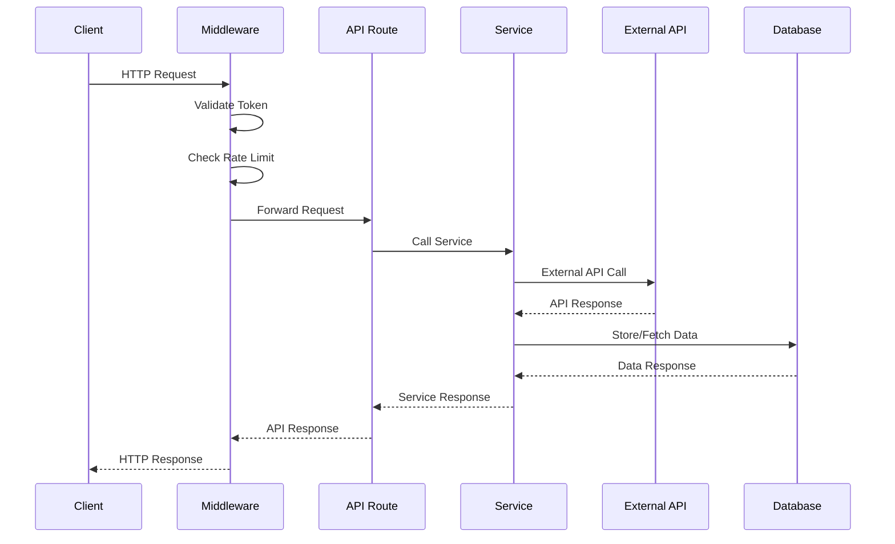
```mermaid
sequenceDiagram
    participant C as  Client
    participant M as  Middleware
    participant A as  API Route
    participant S as  Service
    participant E as  External API
    participant D as  Database

    C->>M: HTTP Request
    M->>M: Validate Token
    M->>M: Check Rate Limit
    M->>A: Forward Request
    A->>S: Call Service
    S->>E: External API Call
    E-->>S: API Response
    S->>D: Store/Fetch Data
    D-->>S: Data Response
    S-->>A: Service Response
    A-->>M: API Response
    M-->>C: HTTP Response
```

### REST API Design

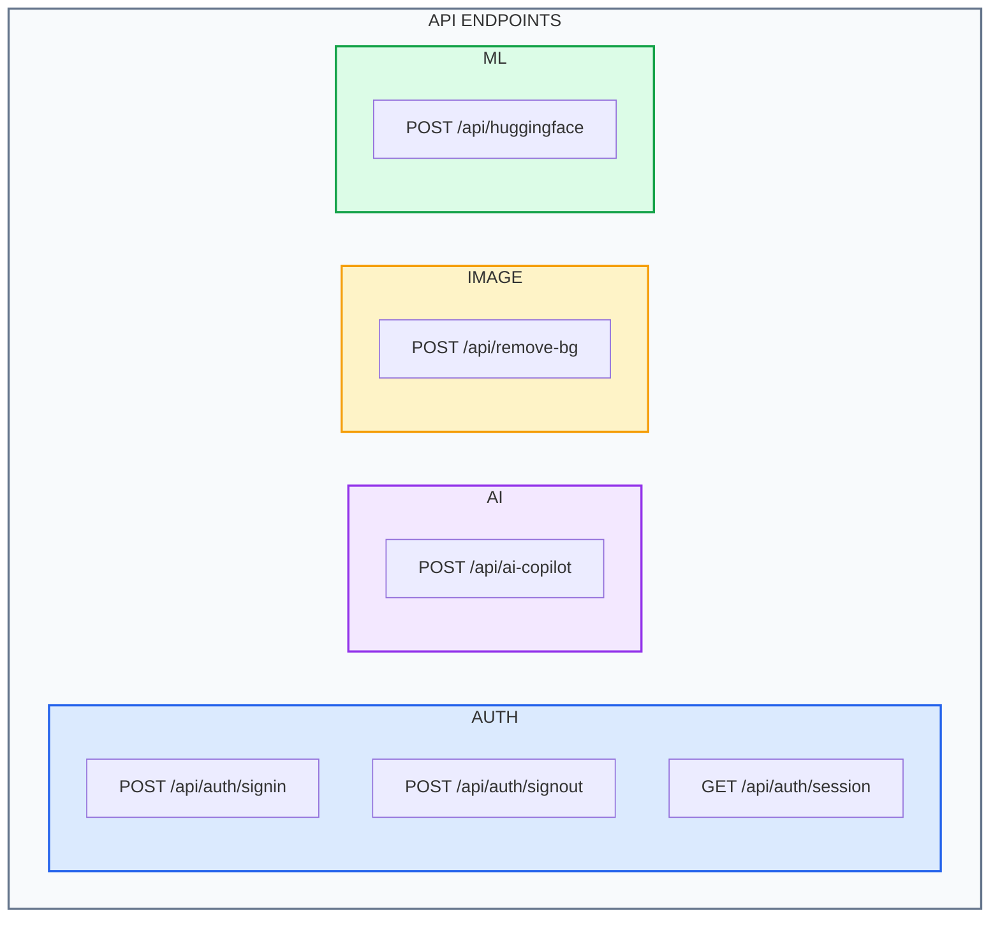
```mermaid
flowchart TB
    subgraph Endpoints[" API ENDPOINTS"]
        direction LR
        
        subgraph Auth[" AUTH"]
            POST_signin["POST /api/auth/signin"]
            POST_signout["POST /api/auth/signout"]
            GET_session["GET /api/auth/session"]
        end
        
        subgraph AI[" AI"]
            POST_copilot["POST /api/ai-copilot"]
        end
        
        subgraph Image[" IMAGE"]
            POST_removebg["POST /api/remove-bg"]
        end
        
        subgraph ML[" ML"]
            POST_hf["POST /api/huggingface"]
        end
    end

    style Endpoints fill:#f8fafc,stroke:#64748b,stroke-width:2px
    style Auth fill:#dbeafe,stroke:#2563eb,stroke-width:2px
    style AI fill:#f3e8ff,stroke:#9333ea,stroke-width:2px
    style Image fill:#fef3c7,stroke:#f59e0b,stroke-width:2px
    style ML fill:#dcfce7,stroke:#16a34a,stroke-width:2px
```

---

## AI Services Architecture

### AI Copilot Architecture

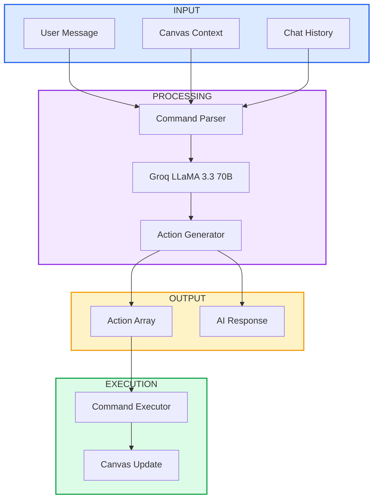
```mermaid
flowchart TB
    subgraph Input[" INPUT"]
        UserMsg[User Message]
        Context[Canvas Context]
        History[Chat History]
    end

    subgraph Processing[" PROCESSING"]
        Parser[Command Parser]
        Groq[Groq LLaMA 3.3 70B]
        ActionGen[Action Generator]
    end

    subgraph Output[" OUTPUT"]
        Actions[Action Array]
        Response[AI Response]
    end

    subgraph Execution[" EXECUTION"]
        Executor[Command Executor]
        Canvas[Canvas Update]
    end

    UserMsg --> Parser
    Context --> Parser
    History --> Parser
    Parser --> Groq
    Groq --> ActionGen
    ActionGen --> Actions
    ActionGen --> Response
    Actions --> Executor
    Executor --> Canvas

    style Input fill:#dbeafe,stroke:#2563eb,stroke-width:2px
    style Processing fill:#f3e8ff,stroke:#9333ea,stroke-width:2px
    style Output fill:#fef3c7,stroke:#f59e0b,stroke-width:2px
    style Execution fill:#dcfce7,stroke:#16a34a,stroke-width:2px
```

### AI Command Processing

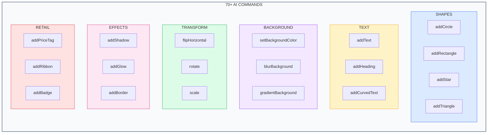
```mermaid
flowchart LR
    subgraph Commands[" 70+ AI COMMANDS"]
        direction TB
        
        subgraph Shapes[" SHAPES"]
            Circle[addCircle]
            Rect[addRectangle]
            Star[addStar]
            Triangle[addTriangle]
        end
        
        subgraph Text[" TEXT"]
            AddText[addText]
            Heading[addHeading]
            Curved[addCurvedText]
        end
        
        subgraph Background[" BACKGROUND"]
            SetBG[setBackgroundColor]
            Blur[blurBackground]
            Gradient[gradientBackground]
        end
        
        subgraph Transform[" TRANSFORM"]
            Flip[flipHorizontal]
            Rotate[rotate]
            Scale[scale]
        end
        
        subgraph Effects[" EFFECTS"]
            Shadow[addShadow]
            Glow[addGlow]
            Border[addBorder]
        end
        
        subgraph Retail[" RETAIL"]
            Price[addPriceTag]
            Ribbon[addRibbon]
            Badge[addBadge]
        end
    end

    style Commands fill:#f8fafc,stroke:#64748b,stroke-width:2px
    style Shapes fill:#dbeafe,stroke:#2563eb
    style Text fill:#fef3c7,stroke:#f59e0b
    style Background fill:#f3e8ff,stroke:#9333ea
    style Transform fill:#dcfce7,stroke:#16a34a
    style Effects fill:#fce7f3,stroke:#db2777
    style Retail fill:#fee2e2,stroke:#dc2626
```

### Background Removal Flow

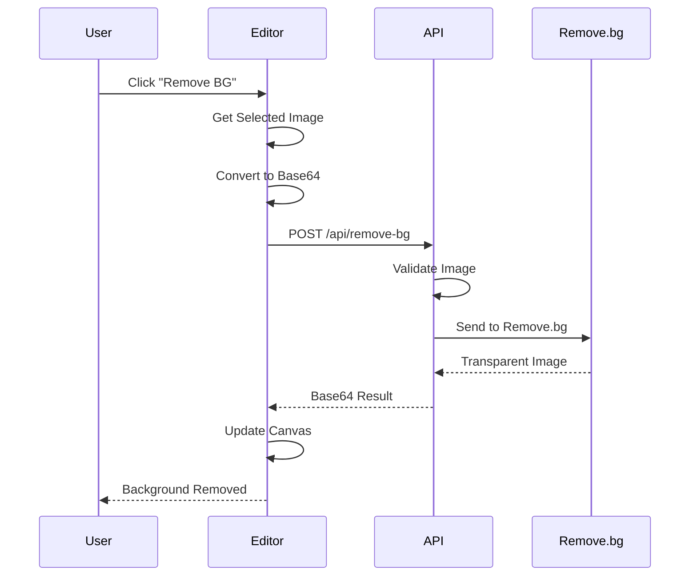
```mermaid
sequenceDiagram
    participant U as  User
    participant E as  Editor
    participant A as  API
    participant R as  Remove.bg

    U->>E: Click "Remove BG"
    E->>E: Get Selected Image
    E->>E: Convert to Base64
    E->>A: POST /api/remove-bg
    A->>A: Validate Image
    A->>R: Send to Remove.bg
    R-->>A: Transparent Image
    A-->>E: Base64 Result
    E->>E: Update Canvas
    E-->>U: Background Removed 
```

### Stock Images Flow

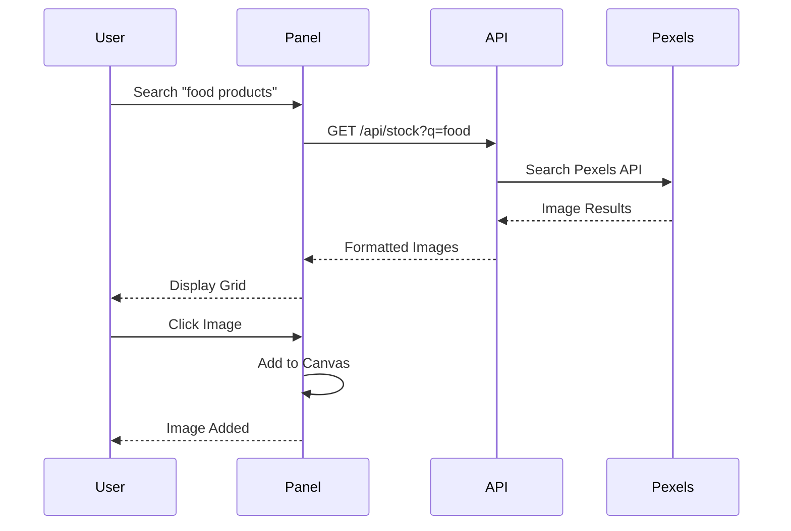
```mermaid
sequenceDiagram
    participant U as  User
    participant P as  Panel
    participant A as  API
    participant X as  Pexels

    U->>P: Search "food products"
    P->>A: GET /api/stock?q=food
    A->>X: Search Pexels API
    X-->>A: Image Results
    A-->>P: Formatted Images
    P-->>U: Display Grid
    U->>P: Click Image
    P->>P: Add to Canvas
    P-->>U: Image Added 
```

---

## Authentication Flow

### Google OAuth Flow

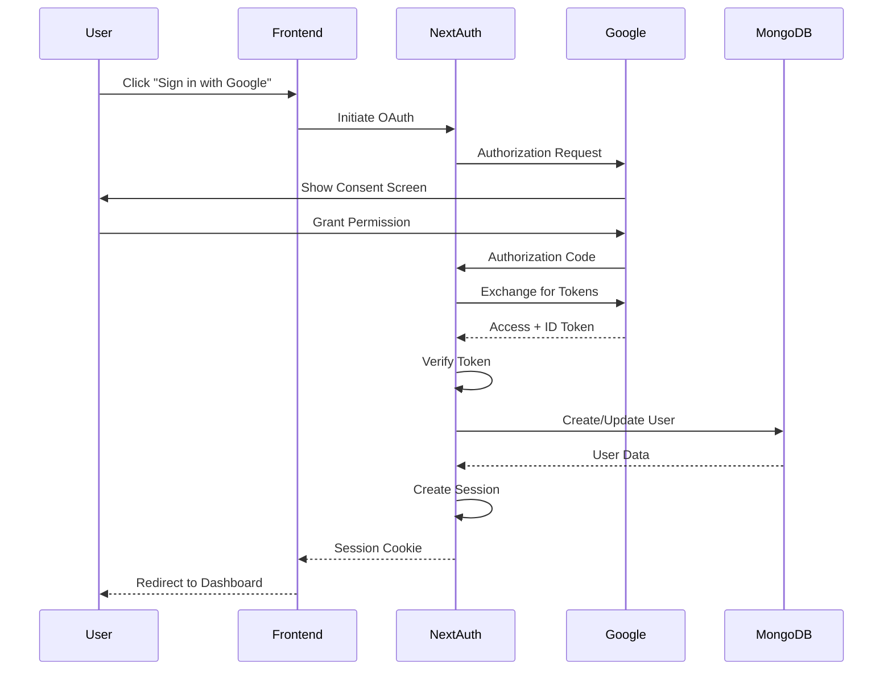
```mermaid
sequenceDiagram
    participant U as  User
    participant F as  Frontend
    participant N as  NextAuth
    participant G as  Google
    participant D as  MongoDB

    U->>F: Click "Sign in with Google"
    F->>N: Initiate OAuth
    N->>G: Authorization Request
    G->>U: Show Consent Screen
    U->>G: Grant Permission
    G->>N: Authorization Code
    N->>G: Exchange for Tokens
    G-->>N: Access + ID Token
    N->>N: Verify Token
    N->>D: Create/Update User
    D-->>N: User Data
    N->>N: Create Session
    N-->>F: Session Cookie
    F-->>U: Redirect to Dashboard 
```

### Session Management

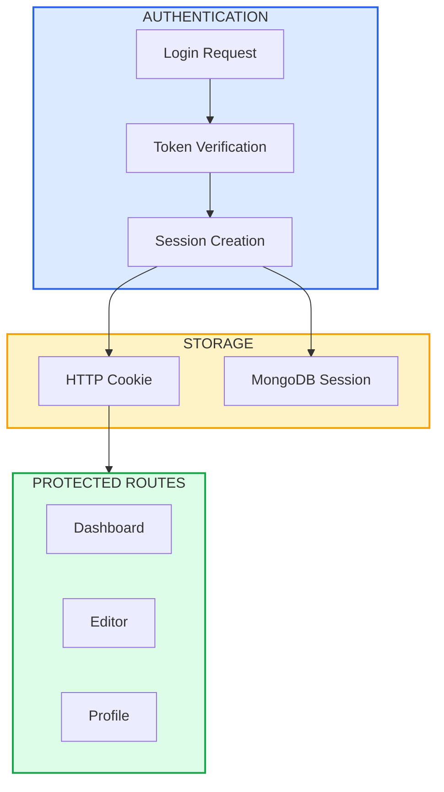
```mermaid
flowchart TB
    subgraph Auth[" AUTHENTICATION"]
        Login[Login Request]
        Verify[Token Verification]
        Session[Session Creation]
    end

    subgraph Storage[" STORAGE"]
        Cookie[HTTP Cookie]
        DB[MongoDB Session]
    end

    subgraph Protected[" PROTECTED ROUTES"]
        Dashboard[Dashboard]
        Editor[Editor]
        Profile[Profile]
    end

    Login --> Verify
    Verify --> Session
    Session --> Cookie
    Session --> DB
    Cookie --> Protected

    style Auth fill:#dbeafe,stroke:#2563eb,stroke-width:2px
    style Storage fill:#fef3c7,stroke:#f59e0b,stroke-width:2px
    style Protected fill:#dcfce7,stroke:#16a34a,stroke-width:2px
```

### Authorization Levels

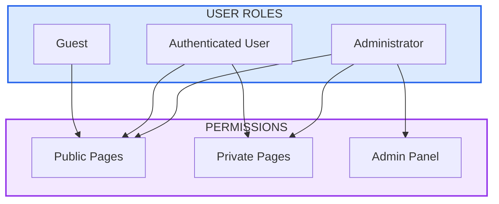
```mermaid
flowchart TB
    subgraph Roles[" USER ROLES"]
        Guest[Guest]
        User[Authenticated User]
        Admin[Administrator]
    end

    subgraph Permissions[" PERMISSIONS"]
        direction TB
        Public[Public Pages]
        Private[Private Pages]
        AdminPanel[Admin Panel]
    end

    Guest --> Public
    User --> Public
    User --> Private
    Admin --> Public
    Admin --> Private
    Admin --> AdminPanel

    style Roles fill:#dbeafe,stroke:#2563eb,stroke-width:2px
    style Permissions fill:#f3e8ff,stroke:#9333ea,stroke-width:2px
```

---

## Data Flow

### Complete Data Flow

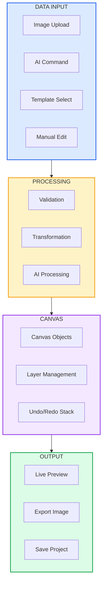
```mermaid
flowchart TB
    subgraph Input[" DATA INPUT"]
        Upload[Image Upload]
        Command[AI Command]
        Template[Template Select]
        Manual[Manual Edit]
    end

    subgraph Process[" PROCESSING"]
        Validate[Validation]
        Transform[Transformation]
        AIProcess[AI Processing]
    end

    subgraph Canvas[" CANVAS"]
        Objects[Canvas Objects]
        Layers[Layer Management]
        History[Undo/Redo Stack]
    end

    subgraph Output[" OUTPUT"]
        Preview[Live Preview]
        Export[Export Image]
        Save[Save Project]
    end

    Input --> Process
    Process --> Canvas
    Canvas --> Output

    style Input fill:#dbeafe,stroke:#2563eb,stroke-width:2px
    style Process fill:#fef3c7,stroke:#f59e0b,stroke-width:2px
    style Canvas fill:#f3e8ff,stroke:#9333ea,stroke-width:2px
    style Output fill:#dcfce7,stroke:#16a34a,stroke-width:2px
```

### Image Processing Pipeline

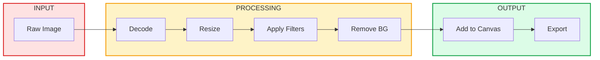
```mermaid
flowchart LR
    subgraph Input[" INPUT"]
        Raw[Raw Image]
    end

    subgraph Processing[" PROCESSING"]
        Decode[Decode]
        Resize[Resize]
        Filter[Apply Filters]
        RemoveBG[Remove BG]
    end

    subgraph Output[" OUTPUT"]
        Canvas[Add to Canvas]
        Export[Export]
    end

    Raw --> Decode
    Decode --> Resize
    Resize --> Filter
    Filter --> RemoveBG
    RemoveBG --> Canvas
    Canvas --> Export

    style Input fill:#fee2e2,stroke:#dc2626,stroke-width:2px
    style Processing fill:#fef3c7,stroke:#f59e0b,stroke-width:2px
    style Output fill:#dcfce7,stroke:#16a34a,stroke-width:2px
```

---

## Canvas Editor Architecture

### Fabric.js Integration

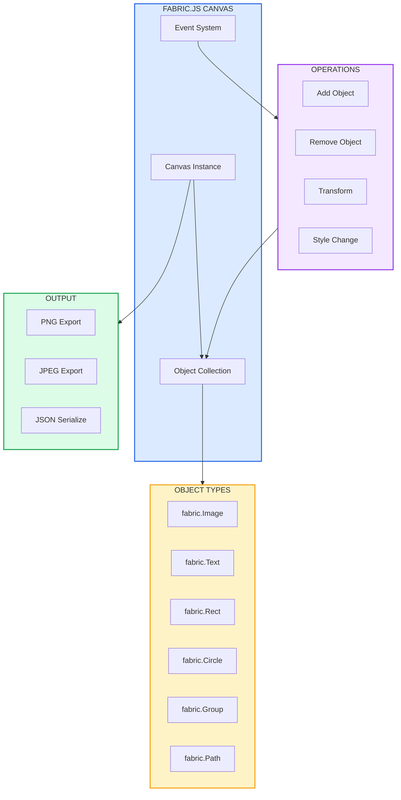
```mermaid
flowchart TB
    subgraph FabricCanvas[" FABRIC.JS CANVAS"]
        Canvas[Canvas Instance]
        Objects[Object Collection]
        Events[Event System]
    end

    subgraph ObjectTypes[" OBJECT TYPES"]
        Image[fabric.Image]
        Text[fabric.Text]
        Rect[fabric.Rect]
        Circle[fabric.Circle]
        Group[fabric.Group]
        Path[fabric.Path]
    end

    subgraph Operations[" OPERATIONS"]
        Add[Add Object]
        Remove[Remove Object]
        Transform[Transform]
        Style[Style Change]
    end

    subgraph Output[" OUTPUT"]
        PNG[PNG Export]
        JPEG[JPEG Export]
        JSON[JSON Serialize]
    end

    Canvas --> Objects
    Objects --> ObjectTypes
    Events --> Operations
    Operations --> Objects
    Canvas --> Output

    style FabricCanvas fill:#dbeafe,stroke:#2563eb,stroke-width:2px
    style ObjectTypes fill:#fef3c7,stroke:#f59e0b,stroke-width:2px
    style Operations fill:#f3e8ff,stroke:#9333ea,stroke-width:2px
    style Output fill:#dcfce7,stroke:#16a34a,stroke-width:2px
```

### Editor Methods Architecture

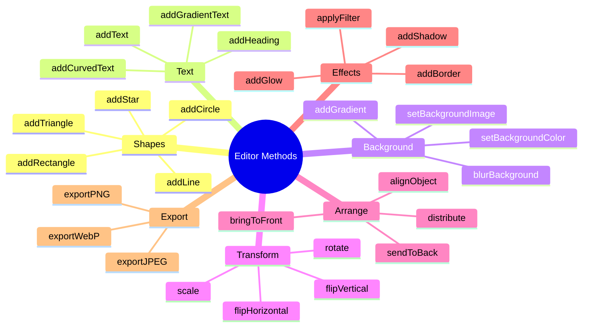
```mermaid
mindmap
    root((Editor Methods))
        Shapes
            addCircle
            addRectangle
            addTriangle
            addStar
            addLine
        Text
            addText
            addHeading
            addCurvedText
            addGradientText
        Background
            setBackgroundColor
            setBackgroundImage
            blurBackground
            addGradient
        Transform
            flipHorizontal
            flipVertical
            rotate
            scale
        Arrange
            bringToFront
            sendToBack
            alignObject
            distribute
        Effects
            addShadow
            addGlow
            addBorder
            applyFilter
        Export
            exportPNG
            exportJPEG
            exportWebP
```

### Layer Management

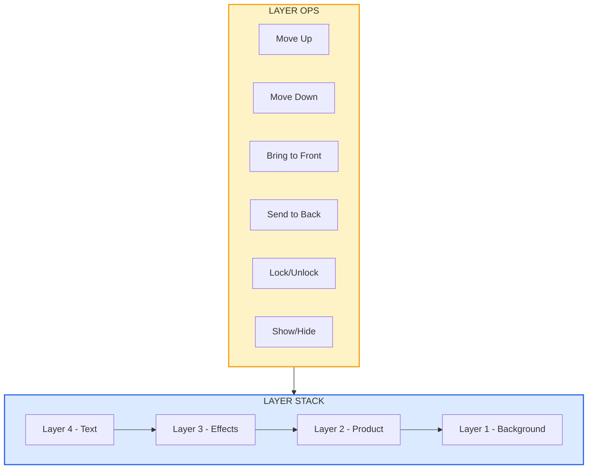
```mermaid
flowchart TB
    subgraph Layers[" LAYER STACK"]
        L4[Layer 4 - Text]
        L3[Layer 3 - Effects]
        L2[Layer 2 - Product]
        L1[Layer 1 - Background]
    end

    subgraph Operations[" LAYER OPS"]
        Up[Move Up]
        Down[Move Down]
        Top[Bring to Front]
        Bottom[Send to Back]
        Lock[Lock/Unlock]
        Hide[Show/Hide]
    end

    L4 --> L3
    L3 --> L2
    L2 --> L1
    Operations --> Layers

    style Layers fill:#dbeafe,stroke:#2563eb,stroke-width:2px
    style Operations fill:#fef3c7,stroke:#f59e0b,stroke-width:2px
```

---

## API Endpoints

### POST /api/ai-copilot

```mermaid
sequenceDiagram
    participant C as Client
    participant A as API
    participant G as Groq

    Note over C,G: AI Copilot Request Flow
    
    C->>A: POST /api/ai-copilot
    Note right of C: { messages, canvasContext }
    
    A->>A: Validate Request
    A->>G: Send to Groq LLaMA
    G-->>A: AI Response + Actions
    A-->>C: { message, actions[] }
    
    Note over C: Execute Actions on Canvas
```

**Request:**
```json
{
  "messages": [
    { "role": "user", "content": "add red circle" }
  ],
  "canvasContext": {
    "width": 728,
    "height": 90,
    "backgroundColor": "#ffffff",
    "objectCount": 5
  }
}
```

**Response:**
```json
{
  "message": "Added a red circle to the canvas",
  "actions": [
    {
      "command": "addCircle",
      "params": { "fill": "#ff0000" }
    }
  ]
}
```

### POST /api/remove-bg

```mermaid
sequenceDiagram
    participant C as Client
    participant A as API
    participant R as Remove.bg

    Note over C,R: Background Removal Flow
    
    C->>A: POST /api/remove-bg
    Note right of C: { image: base64 }
    
    A->>A: Validate Image
    A->>R: Send to Remove.bg
    R-->>A: Transparent Image
    A-->>C: { result: base64 }
```

**Request:**
```json
{
  "image": "data:image/png;base64,..."
}
```

**Response:**
```json
{
  "result": "data:image/png;base64,..."
}
```

### Authentication Endpoints

```mermaid
flowchart LR
    subgraph Auth[" AUTH ENDPOINTS"]
        direction TB
        
        Signin["POST /api/auth/signin
        → Initiate login"]
        
        Signout["POST /api/auth/signout
        → End session"]
        
        Session["GET /api/auth/session
        → Get current session"]
        
        Callback["GET /api/auth/callback/google
        → OAuth callback"]
    end

    style Auth fill:#dbeafe,stroke:#2563eb,stroke-width:2px
```

---

## Database Schema

### MongoDB Collections

```mermaid
erDiagram
    USERS {
        ObjectId _id PK
        String name
        String email UK
        String image
        DateTime emailVerified
        DateTime createdAt
        DateTime updatedAt
    }

    ACCOUNTS {
        ObjectId _id PK
        ObjectId userId FK
        String type
        String provider
        String providerAccountId
        String access_token
        String refresh_token
        Int expires_at
    }

    SESSIONS {
        ObjectId _id PK
        ObjectId userId FK
        String sessionToken UK
        DateTime expires
    }

    PROJECTS {
        ObjectId _id PK
        ObjectId userId FK
        String name
        JSON canvasData
        DateTime createdAt
        DateTime updatedAt
    }

    USERS ||--o{ ACCOUNTS : has
    USERS ||--o{ SESSIONS : has
    USERS ||--o{ PROJECTS : owns
```

### Data Relationships

```mermaid
flowchart TB
    subgraph User[" USER"]
        UserData[User Data]
    end

    subgraph Related["🔗 RELATED DATA"]
        Accounts[OAuth Accounts]
        Sessions[Active Sessions]
        Projects[Saved Projects]
    end

    UserData --> Accounts
    UserData --> Sessions
    UserData --> Projects

    style User fill:#dbeafe,stroke:#2563eb,stroke-width:2px
    style Related fill:#fef3c7,stroke:#f59e0b,stroke-width:2px
```

---

## Deployment Architecture

### Vercel Deployment

```mermaid
flowchart TB
    subgraph Dev["💻 DEVELOPMENT"]
        LocalDev[Local Development]
        Git[Git Repository]
    end

    subgraph CI[" CI/CD"]
        Push[Git Push]
        Build[Vercel Build]
        Deploy[Deploy]
    end

    subgraph Prod[" PRODUCTION"]
        Edge[Vercel Edge Network]
        Serverless[Serverless Functions]
        Static[Static Assets]
    end

    subgraph External[" EXTERNAL"]
        MongoDB[(MongoDB Atlas)]
        APIs[External APIs]
    end

    LocalDev --> Git
    Git --> Push
    Push --> Build
    Build --> Deploy
    Deploy --> Edge
    Edge --> Serverless
    Edge --> Static
    Serverless --> MongoDB
    Serverless --> APIs

    style Dev fill:#dbeafe,stroke:#2563eb,stroke-width:2px
    style CI fill:#fef3c7,stroke:#f59e0b,stroke-width:2px
    style Prod fill:#dcfce7,stroke:#16a34a,stroke-width:2px
    style External fill:#f3e8ff,stroke:#9333ea,stroke-width:2px
```

### Infrastructure Overview

```mermaid
flowchart LR
    subgraph Users[" USERS"]
        Browser[Web Browsers]
    end

    subgraph CDN[" CDN"]
        Vercel[Vercel Edge]
    end

    subgraph Compute[" COMPUTE"]
        SSR[SSR Functions]
        API[API Functions]
    end

    subgraph Data[" DATA"]
        Mongo[(MongoDB)]
    end

    subgraph Services[" SERVICES"]
        Groq[Groq AI]
        RemoveBG[Remove.bg]
        Pexels[Pexels]
        Google[Google OAuth]
    end

    Browser --> Vercel
    Vercel --> SSR
    Vercel --> API
    API --> Mongo
    API --> Groq
    API --> RemoveBG
    API --> Pexels
    API --> Google

    style Users fill:#dbeafe,stroke:#2563eb,stroke-width:2px
    style CDN fill:#fef3c7,stroke:#f59e0b,stroke-width:2px
    style Compute fill:#f3e8ff,stroke:#9333ea,stroke-width:2px
    style Data fill:#dcfce7,stroke:#16a34a,stroke-width:2px
    style Services fill:#fce7f3,stroke:#db2777,stroke-width:2px
```

---

## Error Handling

### Error Flow

```mermaid
flowchart TB
    subgraph Request[" REQUEST"]
        Incoming[Incoming Request]
    end

    subgraph Validation[" VALIDATION"]
        AuthCheck{Auth Valid?}
        InputCheck{Input Valid?}
        RateCheck{Rate OK?}
    end

    subgraph Errors[" ERRORS"]
        E401[401 Unauthorized]
        E400[400 Bad Request]
        E429[429 Too Many]
        E500[500 Server Error]
    end

    subgraph Success[" SUCCESS"]
        Process[Process Request]
        Response[200 Response]
    end

    Incoming --> AuthCheck
    AuthCheck -->|No| E401
    AuthCheck -->|Yes| InputCheck
    InputCheck -->|No| E400
    InputCheck -->|Yes| RateCheck
    RateCheck -->|No| E429
    RateCheck -->|Yes| Process
    Process -->|Error| E500
    Process -->|OK| Response

    style Request fill:#dbeafe,stroke:#2563eb,stroke-width:2px
    style Validation fill:#fef3c7,stroke:#f59e0b,stroke-width:2px
    style Errors fill:#fee2e2,stroke:#dc2626,stroke-width:2px
    style Success fill:#dcfce7,stroke:#16a34a,stroke-width:2px
```

---

## Security Architecture

### Security Layers

```mermaid
flowchart TB
    subgraph Layer1[" LAYER 1 - NETWORK"]
        HTTPS[HTTPS/TLS]
        CORS[CORS Policy]
        CSP[Content Security Policy]
    end

    subgraph Layer2[" LAYER 2 - AUTH"]
        OAuth[OAuth 2.0]
        JWT[JWT Tokens]
        Session[Session Management]
    end

    subgraph Layer3[" LAYER 3 - VALIDATION"]
        Input[Input Validation]
        Sanitize[Data Sanitization]
        TypeCheck[Type Checking]
    end

    subgraph Layer4[" LAYER 4 - DATA"]
        Encrypt[Encryption at Rest]
        Secure[Secure Connections]
        Backup[Regular Backups]
    end

    Layer1 --> Layer2
    Layer2 --> Layer3
    Layer3 --> Layer4

    style Layer1 fill:#dbeafe,stroke:#2563eb,stroke-width:2px
    style Layer2 fill:#fef3c7,stroke:#f59e0b,stroke-width:2px
    style Layer3 fill:#f3e8ff,stroke:#9333ea,stroke-width:2px
    style Layer4 fill:#dcfce7,stroke:#16a34a,stroke-width:2px
```

---

<p align="center">
  <strong>RetailSync AI Architecture</strong><br/>
  Built with Next.js 16 • React 19 • Fabric.js • Groq AI
</p>
