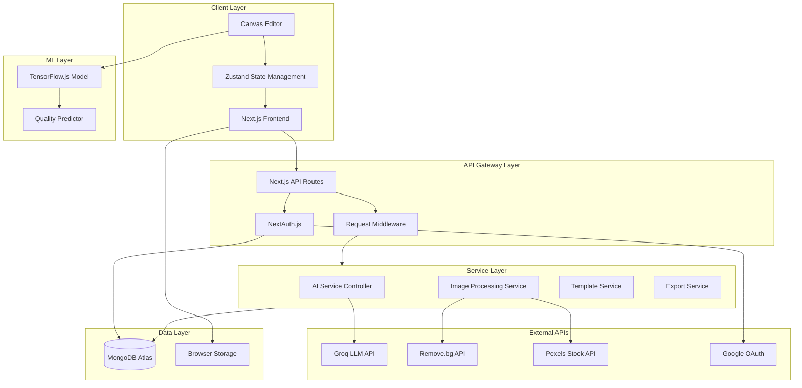
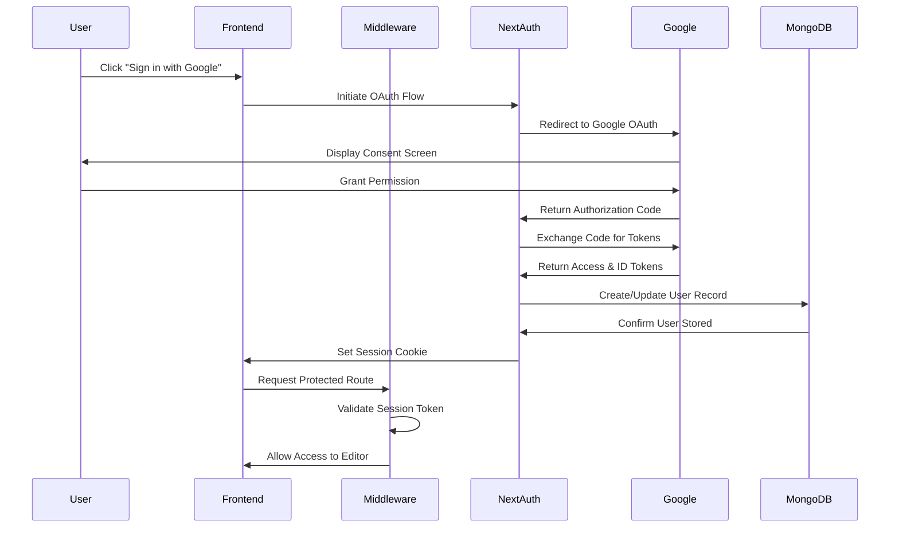
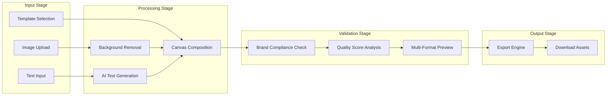
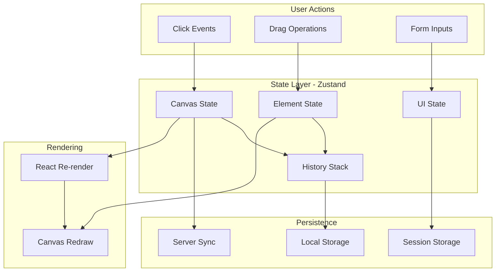
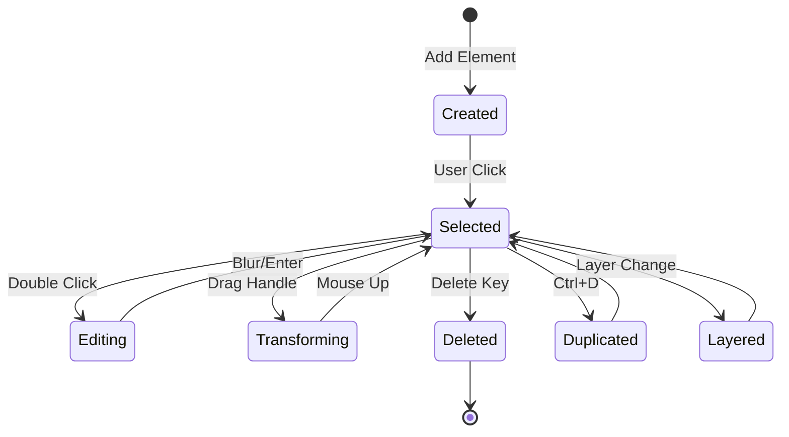

# RetailSync AI

**AI-Powered Retail Media Ad Creation Platform**

> Built for Tesco Retail Media Hackathon 2025

---

## Table of Contents

- [Overview](#overview)
- [Problem Statement](#problem-statement)
- [Our Solution](#our-solution)
- [Key Features](#key-features)
- [System Architecture](#system-architecture)
- [Technology Stack](#technology-stack)
- [API Integrations](#api-integrations)
- [Data Flow](#data-flow)
- [Project Structure](#project-structure)
- [Security & Compliance](#security--compliance)
- [Performance Optimizations](#performance-optimizations)
- [Future Roadmap](#future-roadmap)
- [Team](#team)

---

## Overview

RetailSync AI is an intelligent retail media advertisement creation platform designed specifically for Tesco's retail ecosystem. The platform leverages artificial intelligence to streamline the ad creation process, ensuring brand compliance, visual consistency, and rapid production of high-quality marketing assets.

The platform addresses the critical challenge faced by retail media teams: creating compliant, visually appealing advertisements at scale while maintaining brand guidelines and reducing time-to-market.

---

## Problem Statement

### Current Challenges in Retail Media

| Challenge | Impact |
|-----------|--------|
| **Manual Ad Creation** | 4-6 hours per advertisement, limiting campaign scalability |
| **Brand Inconsistency** | 30% of ads require revision due to guideline violations |
| **Resource Intensive** | Requires specialized design skills and expensive tools |
| **Slow Time-to-Market** | 48-72 hours from brief to final approved asset |
| **Compliance Issues** | Manual verification leads to errors and brand dilution |

### The Gap We Identified

Retail media teams at organizations like Tesco manage thousands of SKUs across multiple categories. Each product may require multiple ad variants for different placements, seasons, and promotions. The traditional workflow creates bottlenecks:

1. **Brief Creation** → Marketing team drafts requirements
2. **Design Queue** → Designers are overwhelmed with requests
3. **Revision Cycles** → Average 3-4 rounds of feedback
4. **Compliance Check** → Manual verification against brand guidelines
5. **Final Approval** → Multiple stakeholder sign-offs

This process is unsustainable for modern retail media operations that demand agility and scale.

---

## Our Solution

RetailSync AI transforms the ad creation workflow through intelligent automation:

```
Traditional: 4-6 hours per ad → RetailSync AI: Under 5 minutes
```

### Core Value Propositions

**1. AI-Powered Design Assistance**
- Intelligent layout suggestions based on content type
- Automated color harmony and typography pairing
- Smart object positioning with rule-of-thirds alignment

**2. Real-Time Brand Compliance**
- Continuous validation against Tesco brand guidelines
- Automated logo placement and safe zone verification
- Color palette enforcement with accessibility checks

**3. Instant Background Processing**
- One-click background removal for product images
- AI-powered background generation and replacement
- Seamless integration with product photography workflow

**4. Intelligent Copy Generation**
- Context-aware headline and tagline suggestions
- Promotional copy that adheres to advertising standards
- Multi-variant generation for A/B testing

---

## Key Features

### Canvas Editor
A professional-grade design environment built for speed and precision:
- Multi-layer composition with z-index management
- Precise object manipulation (resize, rotate, flip, align)
- Grid and snap-to-guide functionality
- Real-time preview across multiple ad formats

### AI Integration Suite
- **Text Generation**: Groq LLM integration for instant copy creation
- **Image Processing**: Remove.bg API for background removal
- **Asset Discovery**: Pexels API for royalty-free stock imagery
- **Quality Scoring**: TensorFlow.js model for ad effectiveness prediction

### Template Marketplace
- Pre-approved templates for common retail scenarios
- Category-specific designs (grocery, electronics, fashion)
- Seasonal and promotional templates
- Custom template creation and sharing

### Export & Distribution
- Multiple format export (PNG, JPEG, WebP)
- Resolution optimization for different placements
- Direct integration capability with ad platforms
- Batch export for campaign assets

---

## System Architecture

### High-Level Architecture



### Authentication Flow



### Ad Creation Pipeline



---

## Technology Stack

### Frontend Architecture

| Layer | Technology | Purpose |
|-------|------------|---------|
| Framework | Next.js 16 | Server-side rendering, API routes, file-based routing |
| Language | TypeScript | Type safety, enhanced developer experience |
| Styling | Tailwind CSS | Utility-first CSS, rapid UI development |
| State | Zustand | Lightweight state management for canvas operations |
| Canvas | HTML5 Canvas API | High-performance 2D rendering |
| Icons | Lucide React | Consistent, accessible iconography |

### Backend Architecture

| Layer | Technology | Purpose |
|-------|------------|---------|
| Runtime | Node.js 20 | JavaScript runtime for server operations |
| API | Next.js API Routes | RESTful endpoints, serverless functions |
| Authentication | NextAuth.js | OAuth providers, session management |
| Database | MongoDB Atlas | Document storage, user data persistence |
| Validation | Zod | Runtime schema validation |

### Machine Learning

| Component | Technology | Purpose |
|-----------|------------|---------|
| Runtime | TensorFlow.js | Browser-based ML inference |
| Model Format | Keras → TFJS | Converted model for web deployment |
| Training | Python + TensorFlow | Offline model training pipeline |

---

## API Integrations

### Groq LLM API

**Purpose**: AI-powered text generation for ad copy, headlines, and taglines.

**Integration Details**:
- Model: LLaMA 3.3 70B Versatile
- Endpoint: `https://api.groq.com/openai/v1/chat/completions`
- Authentication: Bearer token
- Rate Limit: 30 requests/minute

**Use Cases**:
- Generate compelling product headlines
- Create promotional taglines
- Suggest call-to-action text
- Produce A/B test variants

**Request Flow**:
```
User Input → Context Building → Groq API → Response Parsing → UI Display
```

### Remove.bg API

**Purpose**: Automated background removal from product images.

**Integration Details**:
- Endpoint: `https://api.remove.bg/v1.0/removebg`
- Authentication: API Key header
- Output Format: PNG with transparency
- Processing: Server-side to protect API key

**Technical Implementation**:
- Image uploaded as base64 or URL
- API returns transparent PNG
- Result cached for session duration
- Fallback to manual editing if API unavailable

### Pexels API

**Purpose**: Access to royalty-free stock photography and backgrounds.

**Integration Details**:
- Endpoint: `https://api.pexels.com/v1/search`
- Authentication: API Key header
- Results: Paginated (15 per page)
- Licensing: Free for commercial use

**Features Utilized**:
- Keyword-based image search
- Curated collections for retail categories
- Multiple resolution downloads
- Attribution handling

### Google OAuth 2.0

**Purpose**: Secure user authentication without password management.

**Integration Details**:
- Provider: Google Cloud Platform
- Scopes: `email`, `profile`, `openid`
- Token Type: JWT
- Session: Server-side with HTTP-only cookies

**Security Measures**:
- PKCE flow for authorization
- Secure cookie attributes
- CSRF token validation
- Session rotation on sensitive operations

---

## Data Flow

### State Management Architecture



### Canvas Element Lifecycle



---

## Project Structure

```
retailsync-nextjs/
├── src/
│   ├── app/                    # Next.js App Router
│   │   ├── api/                # API Routes
│   │   │   ├── auth/           # NextAuth configuration
│   │   │   ├── ai/             # AI service endpoints
│   │   │   ├── remove-bg/      # Background removal proxy
│   │   │   └── stock-images/   # Pexels API proxy
│   │   ├── auth/               # Authentication pages
│   │   ├── editor/             # Main canvas editor
│   │   └── page.tsx            # Landing page
│   │
│   ├── components/             # React Components
│   │   ├── layout/             # Navigation, Footer
│   │   ├── providers/          # Context Providers
│   │   ├── editor/             # Editor-specific components
│   │   └── ui/                 # Reusable UI components
│   │
│   ├── lib/                    # Utility Libraries
│   │   ├── api.ts              # API client functions
│   │   ├── auth.ts             # Authentication utilities
│   │   └── canvas.ts           # Canvas helper functions
│   │
│   ├── stores/                 # Zustand State Stores
│   │   └── canvasStore.ts      # Canvas state management
│   │
│   ├── types/                  # TypeScript Definitions
│   │   └── index.ts            # Shared type definitions
│   │
│   └── middleware.ts           # Request middleware
│
├── public/                     # Static Assets
│   └── assets/                 # Images, icons, fonts
│
├── models/                     # ML Models
│   └── tfjs_model/             # TensorFlow.js model files
│
└── training/                   # ML Training Pipeline
    ├── train_ad_quality_model.py
    ├── prepare_data.py
    └── inference.py
```

---

## Security & Compliance

### Authentication Security

| Measure | Implementation |
|---------|----------------|
| OAuth 2.0 | Industry-standard authorization framework |
| JWT Tokens | Stateless, cryptographically signed sessions |
| HTTP-Only Cookies | XSS attack prevention |
| CSRF Protection | Token-based request validation |
| Secure Headers | CSP, X-Frame-Options, HSTS |

### API Security

| Measure | Implementation |
|---------|----------------|
| Server-Side Proxy | API keys never exposed to client |
| Rate Limiting | Request throttling per user/IP |
| Input Validation | Zod schema validation on all endpoints |
| Error Handling | Sanitized error messages |

### Data Privacy

- User data stored in encrypted MongoDB Atlas cluster
- No personal data shared with external APIs
- Session data cleared on logout
- GDPR-compliant data handling practices

---

## Performance Optimizations

### Frontend Optimizations

| Optimization | Benefit |
|--------------|---------|
| Next.js Turbopack | 700ms faster cold starts |
| Image Optimization | Automatic WebP conversion, lazy loading |
| Code Splitting | Route-based chunking, reduced initial bundle |
| Canvas Throttling | 60fps rendering with requestAnimationFrame |

### API Optimizations

| Optimization | Benefit |
|--------------|---------|
| Response Caching | Reduced API calls for repeated requests |
| Parallel Requests | Concurrent API calls where possible |
| Streaming Responses | Progressive content loading |
| Connection Pooling | MongoDB connection reuse |

### ML Model Optimizations

| Optimization | Benefit |
|--------------|---------|
| Model Quantization | 4x smaller model size |
| WebGL Backend | GPU-accelerated inference |
| Lazy Loading | Model loaded on first use |

---

## Future Roadmap

### Phase 2: Enhanced AI Capabilities
- Multi-modal AI for image understanding
- Automated layout generation from brief
- Style transfer for brand consistency

### Phase 3: Platform Integration
- Direct publishing to Tesco Retail Media
- Campaign performance analytics
- A/B test automation

### Phase 4: Enterprise Features
- Team collaboration workspaces
- Asset management system
- Approval workflow automation
- Brand guideline enforcement engine

---

## Team

### Team Sarthak

We are a group of passionate developers and designers committed to solving real-world problems through technology.

| Member | Role | Contribution |
|--------|------|--------------|
| **Yashodip More** | Full Stack Developer | Architecture, API Integration, Frontend Development |
| **Komal Kumavat** | Frontend Developer | UI/UX Implementation, Component Design |
| **Jaykumar Girase** | Backend Developer | Database Design, Authentication, API Development |
| **Tejas Patil** | ML Engineer | Model Training, TensorFlow.js Integration |

---

## Acknowledgments

- **Tesco Retail Media** for organizing the hackathon and providing the problem statement
- **Groq** for providing fast LLM inference capabilities
- **Remove.bg** for reliable background removal API
- **Pexels** for extensive royalty-free image library
- **Vercel** for Next.js and deployment infrastructure

---

<p align="center">
  <strong>RetailSync AI</strong> — Empowering Retail Media Teams with AI
</p>

<p align="center">
  Built with precision for Tesco Retail Media Hackathon 2025
</p>

---

**License**: This project was developed for Tesco Retail Media Hackathon 2025. All rights reserved.
